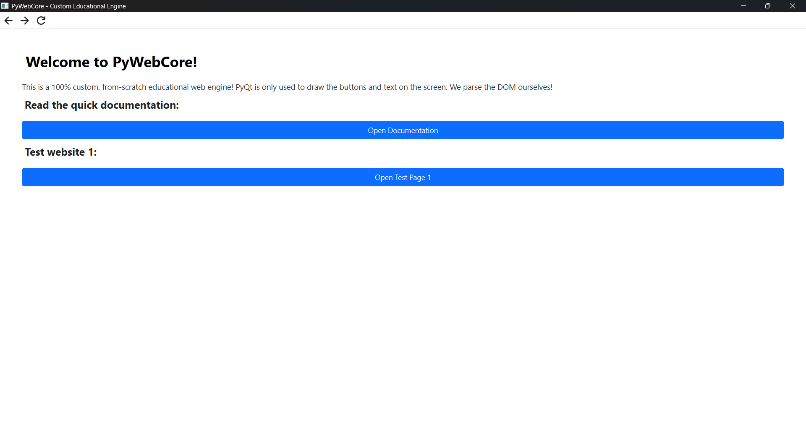

# PyWebCore

PyWebCore is a 100% custom, from-scratch educational web engine and browser built entirely in Python.

Unlike other custom browsers that act as a simple wrapper around off-the-shelf engines like Chromium or QtWebEngine, PyWebCore builds the entire browser pipeline itself. It reads raw HTML, parses it into a custom Document Object Model (DOM) tree, and manually renders the elements onto a blank canvas. PyQt6 is used strictly as a graphical framework to draw buttons and text, not to process the web pages.

This project is meant to be a fun, highly modular sandbox. If you want to learn how web browsers actually work under the hood, this is the perfect place to start.



---

## Getting Started

Running PyWebCore is incredibly fast and only requires one external dependency.

### Prerequisites

Make sure you have Python installed on your computer. Then, install the PyQt6 framework using pip:

```bash
pip install PyQt6
```

---

## How to Run

Simply double click `main.py`.

---

## Contributing

Contributions are highly encouraged! We built this project with a strict separation of concerns, which makes it incredibly easy and beginner-friendly to contribute to. You do not need to understand the whole system to add a new feature.

If you want to work on the UI, you only touch the UI files.
If you want to work on how HTML is read, you only touch the parser.

### Ideas for Contributions

Here are a few fun ideas for things you can contribute:

* **Add Image Support**
  Teach the parser to recognize `img` tags and update the renderer to draw them on the screen.

* **Surf the Real Web**
  Add a URL text bar to the top navigation and update the core engine to use Python's `requests` library to fetch HTML from the internet instead of just reading local files.

* **Basic CSS Parsing**
  Make the renderer read inline `style` attributes from the HTML tags and apply those specific styles to the rendered elements.

* **Better Parsing**
  Our current HTML parser is very naive. Help make it more robust so it can handle poorly formatted HTML or complex nested structures.

---

## How to Contribute

1. Fork the repository.
2. Create a new branch for your feature.
3. Write your code.
4. Test your feature by running the browser and checking the `logs` folder for any errors.
5. Submit a pull request.

---

## License

This project is open-source and available under the **MIT License**.
Feel free to use it, learn from it, and break it!
